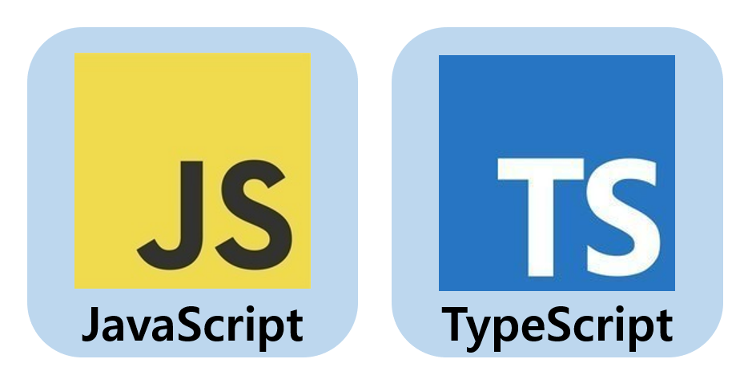
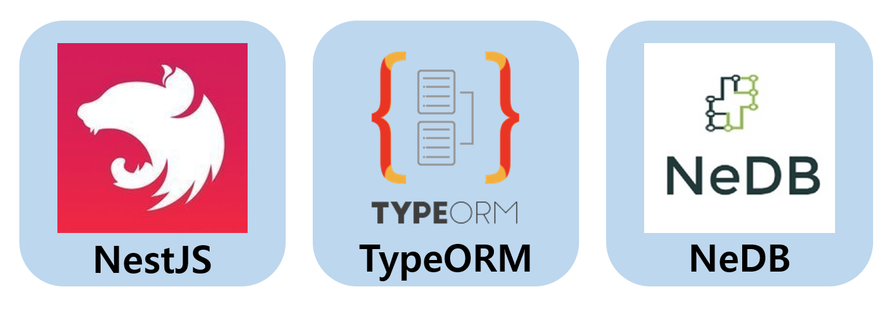
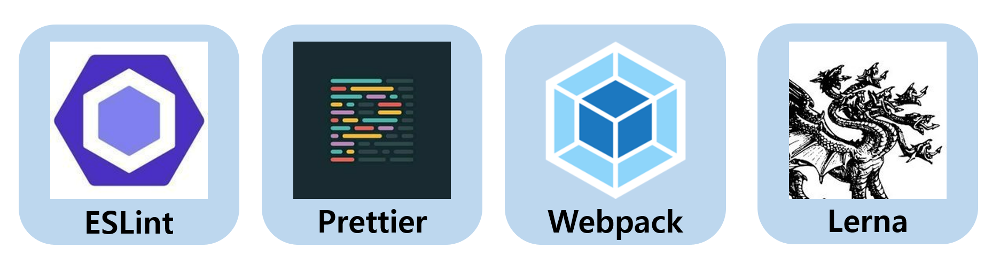

# FrontEnd Crash - TypeScript!🔨
> 프로젝트를 통해 타입스크립트를 뿌셔봅시다!😉

<br>

> 백엔드 추가할 내용
> - 중복 이메일 확인 API
> - 중복 북마크 확인 API

<br>

## 🙇🏻INTRO🙇🏻‍♀️
해당 저장소는 타입스크립트를 기초부터 공부하지만, 최대한 적응하기 쉽게 토이 프로젝트 형식으로 진행합니다.

1. 타입스크립트 기초를 공부하고 팀원들과 공유하며 각자의 프로젝트를 리뷰합니다.
2. 알게 된 점, 고민했던 점, 트러블슈팅에 대한 경험을 이야기함으로써 브레인 스토밍을 이끌어 냅니다.
3. 기초와 함께 이펙티브한 타입스크립트 작성법에 대해 공부합니다. 암기하거나 무작정 복사/붙여넣기를 하지 않고 스터디를 통해 체득하도록 노력합니다.

아래의 `필수 요구사항`을 스터디 기간 내에 끝내는 것을 목표로 합니다. 욕심이 있거나 조금 더 해보자는 생각이 든다면 `추가 구현사항`, `더 해보기` 등의 챌린지를 진행해보세요.

현재 샘플 프로젝트의 프론트엔드는 일부러 구조화, 책임 분리, 클린 코드나 리팩토링의 개념을 완전 배제하고 러프하게 작성되어 있습니다.

타입스크립트를 적용하며 틀에 얽매이지 않고 자신의 코드 작성을 통해 프로젝트를 제대로 완성해보죠!

<br>

## 💪USAGE💪
- 각자 저장소를 fork합니다.
- `packages/{자신의 닉네임}`으로 폴더가 생성되어 있습니다(만약 새로 하는 분이라면 새로 생성하세요!).
  - 반드시 자신의 폴더에서만 작업해주세요.
- 작업 후 PR을 브런치가 아니라 main에 해주시면 됩니다😊

<br>

## 💻INSTALL & RUN💻
- **Install**
  ```sh
  npm install # or npm i
  ```

<br>

- **Run**

  > ⛔️참고⛔️
  > - 현재 스크립트로는 백엔드랑 프론트엔드 같이 못 돌립니다😥 터미널을 나눠서 백엔드/프론트엔드를 같이 실행시켜주세요... 최대한 빠르게 해결해보겠습니다😭

  <br>

  ```sh
  npm run start:api     # backend: server
  npm run start:{닉네임} # frontend: client
  ```
  - ex) `npm run start:parang`

<br>

- **Build**
  ```sh
  npm run build
  ```

<br>

## 🏋️‍♂️REQUIREMENTS🏋️‍♀️
### ☑️ Necessary
- [ ] `*.js`파일을 `*.ts`로 변환합니다.
- [ ] any 타입을 사용하지 않습니다.
- [ ] `type`과 `interface`의 차이를 알고 자신만의 컨벤션으로 작성합니다.
- [ ] UI와 기능을 분리(MVC 적용이나 폴더 구조화 등)합니다.

<br>

### 🟩 Additional
- [ ] API 모듈을 작성합니다.
- [ ] 무한 스크롤을 개선합니다.
- [ ] 유효성 검사를 추가합니다.
- [ ] 테스트 코드를 작성합니다.
- [ ] 프로필 탭을 추가합니다.

<br>

### 🟨 Do more
- [ ] 프레임워크(React, Vue, Svelt)를 적용합니다.

<br>

## 🛠TECH STACK🛠
### 💠Frontend
<div>



</div>

<br>

### 💠Backend
<div>



</div>

<br>

### 💠DevOps
<div>



</div>

<br>

## 📝API📝
### baseUrl

`http://localhost:3000`

<br>

### Create User

| method | uri       |
| ------ | --------- |
| POST   | /api/user |

```js
{
  requestBody: {
    "email": "string",
    "password": "string"
  },
  response: {
    "_id": "string",
    "email": "string",
    "password": "boolean",
    "bookmark": [
      {
        "_id": "string",
        "url": "string",
      },
    ]
  }
}
```

<br>

### Login User

| method | uri             |
| ------ | --------------- |
| POST   | /api/user/login |

```js
{
  requestBody: {
   "email": "string",
   "password": "string"
  },
  response: {
   "_id": "string",
   "email": "string",
   "password": "boolean",
   "bookmark": [
     {
       "_id": "string",
       "url": "string",
     },
    ]
  }
}
```

<br>

### Find Bookmark List

| method | uri                |
| ------ | ------------------ |
| POST   | /api/user/bookmark |

```js
{
  requestBody: {
    "_id": "string",
  },
  response: [
    {
      "_id": "string",
      "url": "string",
    },
  ]
}
```

<br>

### Add Bookmark

| method | uri                            |
| ------ | ------------------------------ |
| POST   | /api/user/bookmark/:bookmarkId |

```js
{
  requestBody: {
    "_id": "string",
  },
  response: {
    "_id": "string",
    "email": "string",
    "password": "boolean",
    "bookmark": [
      {
        "_id": "string",
        "url": "string",
      },
    ]
  }
}
```

<br>

### Remove Bookmark

| method | uri                            |
| ------ | ------------------------------ |
| DELETE | /api/user/bookmark/:bookmarkId |

```js
{
  requestBody: {
    "_id": "string",
  },
  response: "number"
}
```

<br/>

## 👩‍💻CONTRIBUTORS👨‍💻

<table>
  <tr height="140px">
    <td align="center">
      <a href="https://github.com/InSeong-So"></a>
      <br />
      <a href="https://github.com/InSeong-So">파랑 💻</a>
    </td>
    <td align="center">
      <a href="https://github.com/areumsheep"></a>
      <br />
      <a href="https://github.com/areumsheep">조이 💻</a>
    </td>
    <td align="center">
      <a href="https://github.com/parksil0"></a>
      <br />
      <a href="https://github.com/parksil0">Seal 💻</a>
    </td>
    <td align="center">
      <a href="https://github.com/wooooooood"></a>
      <br />
      <a href="https://github.com/wooooooood">나무 💻</a>
    </td>
    <td align="center">
      <a href="https://github.com/yechukim"></a>
      <br />
      <a href="https://github.com/yechukim">예츄 💻</a>
    </td>
    <td align="center">
      <a href="https://github.com/sunhwa508"></a>
      <br />
      <a href="https://github.com/sunhwa508">콘솔 💻</a>
    </td>
  </tr>
</table>

<br>

## ✍️CONVENTION✍️

| 태그                  | 설명                                                                      |
| --------------------- | ------------------------------------------------------------------------- |
| `✒️Feat: `             | 새로운 기능을 추가할 경우                                                 |
| `🛠Fix: `              | 버그를 고친 경우                                                          |
| `✍️Design: `           | CSS 등 사용자 UI 디자인 변경                                              |
| `❗️♻️BREAKING CHANGE: ` | 커다란 API 변경의 경우                                                    |
| `❗️✔️HOTFIX: `          | 급하게 치명적인 버그를 고쳐야하는 경우                                    |
| `🎆Style: `            | 코드 포맷 변경, 세미 콜론 누락, 코드 수정이 없는 경우                     |
| `🗃Refactor: `         | 프로덕션 코드 리팩토링                                                    |
| `💬Comment: `          | 필요한 주석 추가 및 변경                                                  |
| `📝Docs: `             | 문서를 수정한 경우                                                        |
| `🧪Test: `             | 테스트 추가, 테스트 리팩토링(프로덕션 코드 변경 X)                        |
| `🔬Chore: `            | 빌드 태스트 업데이트, 패키지 매니저를 설정하는 경우(프로덕션 코드 변경 X) |
| `✂️Rename: `           | 파일 혹은 폴더명을 수정하거나 옮기는 작업만인 경우                        |
| `🧺Remove: `           | 파일을 삭제하는 작업만 수행한 경우                                        |

<br>

## 📜LICENSE📜

- [MIT](https://opensource.org/licenses/MIT)

<br>